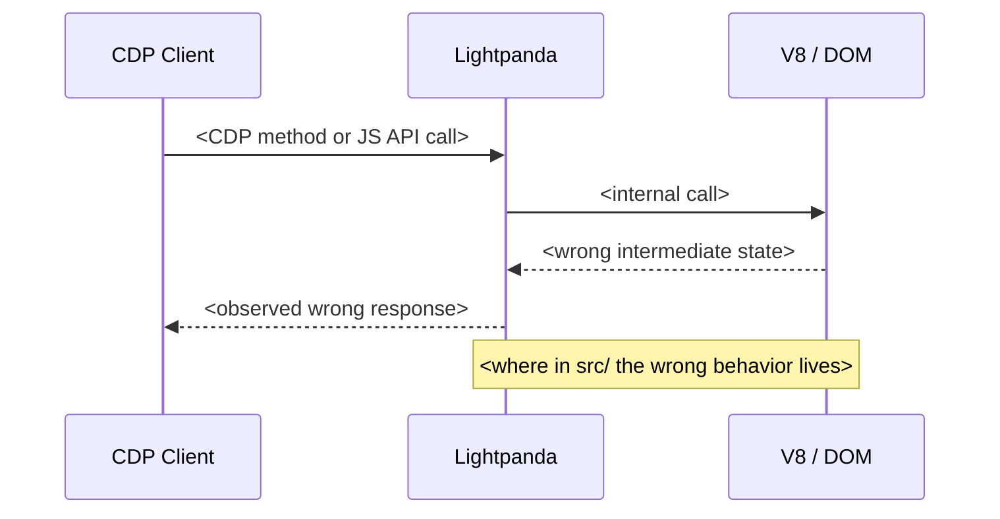
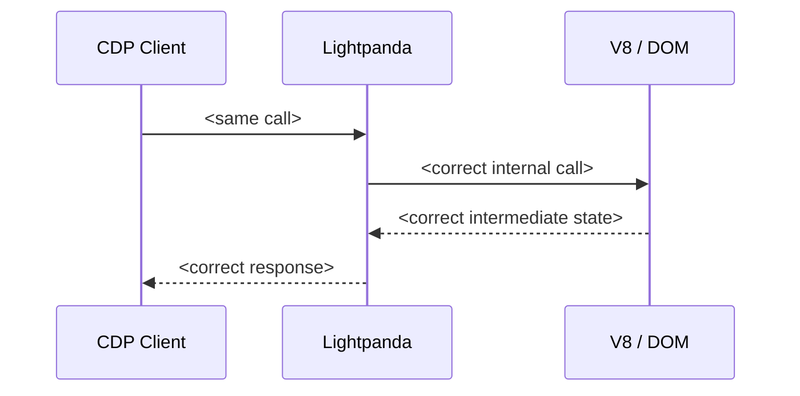

# Templates

Load this file when reaching Step 4 (implementation), Step 6 (reproducer), Step 7 (issue), Step 8 (PR), or Step 9 (report). The fenced blocks below use ` ```` ` (four backticks) on the outside so the inner ` ``` ` mermaid/markdown fences survive copy-paste — strip the outer fence when pasting into GitHub.

Sections:

- [Implementation prompt (Step 4)](#implementation-prompt-step-4) — TDD brief for the Zig change
- [CDP test gotchas (Step 4)](#cdp-test-gotchas-step-4) — non-obvious behaviors of `src/cdp/testing.zig` that bite first-time test authors
- [Reproducer skeleton (Step 6)](#reproducer-skeleton-step-6) — `repro.js` + `repro.sh` with the non-default `chrome-remote-interface` config Lightpanda needs
- [Issue body (Step 7)](#issue-body-step-7) — bug report with broken-vs-expected sequence diagrams
- [Commit message (Step 8)](#commit-message-step-8) — area-prefixed, includes `Closes #<n>`
- [PR description (Step 8)](#pr-description-step-8) — fix-pathway flowchart, test summary
- [Final report to user (Step 9)](#final-report-to-user-step-9) — what shipped, what's next

---

## Implementation prompt (Step 4)

Use this as a self-contained brief. Two ways to apply it:

- **Inline** — work through the TDD steps yourself in the current conversation. Default if the change is small (single file, <100 LOC).
- **Subagent** — spawn a `general-purpose` agent with the prompt as `prompt:`. Better when the change spans multiple Zig files or you want to keep the main context lean.

Either way, fill in the `<...>` placeholders before applying — the prompt assumes a self-contained brief, no outside context.

````
**Context**: Working in `/Users/navid/code/browser`, the Lightpanda browser
(Zig 0.15.2 + V8). Branch `fix-<id>-<slug>`. Need to fix item `<ID>` from the
gem's upstream wishlist: `<one-line description>`.

**Today's behavior**: `<copy from wishlist>`

**Want**: `<copy from wishlist>`

**Where to look**:
- Primary: `<file from file-mapping.md>`
- Related: `<any test fixtures or sibling files>`

**TDD steps**:
1. Write a failing test in `<test file>` that exercises the bug. For CDP fixes
   use `test "cdp.<Domain> <method>"` blocks in the domain `.zig` file
   (pattern: see existing tests in `src/cdp/domains/network.zig`). For JS API
   fixes use HTML fixtures under `src/browser/tests/<area>/` (pattern: see
   `src/browser/tests/element/duplicate_ids.html` from PR #2244).
2. Mentally trace the failing test against current `main` and confirm it
   would fail. Do NOT run `zig build test` (or any `zig build` variant) —
   local Zig builds are forbidden (slow on the user's machine); upstream CI
   verifies on push.
3. Implement the fix in `<primary file>`. Keep the diff minimal — no
   surrounding cleanup, no formatting churn unrelated to the fix.
4. Mentally trace the test against the fixed code path and confirm it would
   now pass. Push the branch and let upstream CI run `zig build test` for
   the real verification — never run it locally.
5. Document any spec/CDP-protocol assumption in a code comment **only if** the
   assumption is non-obvious from the code itself.
````

---

## CDP test gotchas (Step 4)

The `src/cdp/testing.zig` harness is the standard scaffold for `test "cdp.<Domain> <method>"` blocks, but a few non-obvious behaviors will burn an iteration if you don't know them up front.

- **`expectSentEvent("Method", .{}, .{})` is a *strict* empty-object match, not a wildcard.** The `params: .{}` parameter serializes to JSON `"params": {}` and is deep-compared against the received message. Real CDP events almost always carry a populated `params` object (e.g. `Page.frameNavigated` has `params.frame.{id, loaderId, url, ...}`), so an empty-struct expectation never matches and the assertion times out with `ErrorNotFound` on a perfectly-correct fixture. Two workable alternatives:
  - Match a discriminating field: `try ctx.expectSentEvent("Page.frameNavigated", .{ .frame = .{ .loaderId = "LID-0000000002" } }, .{})`. Mind that the loader/frame ID counters are **shared across tests in the same `zig build test` run** — don't hard-pin a value if your test order isn't deterministic.
  - Skip event matching entirely and drain the runner: `var runner = try bc.session.runner(.{}); try runner.wait(.{ .ms = 2000 });`. Cleaner when you only need "navigation finished, now I'll inspect the frame state" without caring which event fired.
- **`Frame.navigate` asserts `_load_state == .waiting`.** A second direct `frame.navigate(...)` on a frame that already loaded panics with `frame.renavigate`. The CDP-side helpers (`doNavigate`, `doReload` in `src/cdp/domains/page.zig`) work around this by calling `session.replacePage()` first when the state isn't `.waiting`, returning a fresh frame in `.waiting`. Mirror that pattern in tests that want to drive multiple navigations on the same browser context — or do the second navigation *as the first* on a context you set up by hand (`cdp_inst.createBrowserContext()` + `bc.session.createPage()`).
- **`loadBrowserContext({ .url = "..." })` does a GET only.** There's no parameter for `method` / `body` / `header`. If your test needs the first navigation to be POST, hand-roll the setup (`createBrowserContext` → set `bc.id`/`session_id`/`target_id` → `bc.session.createPage()` → `frame.navigate(url, .{ .method = .POST, .body = ..., .header = ... })`) instead of trying to bend `loadBrowserContext`.
- **Adding HTTP routes goes in `src/testing.zig`'s `testHTTPHandler`.** It's a flat `if (std.mem.eql(u8, path, ...))` chain that responds via `req.respond(...)`. The handler runs synchronously per request; `req.head.method` gives the HTTP method, and you don't have to read or discard the request body before responding. Reuse existing routes (`/xhr`, `/xhr/json`) where possible to keep the test surface small.

---

## Reproducer skeleton (Step 6)

Lightpanda's CDP endpoint behaves *differently enough* from Chrome that the default `chrome-remote-interface` config breaks. Two non-obvious gotchas, both folded into the skeleton below:

- **Target discovery is empty.** `/json/list` returns `[]`, so the default `await CDP({port: 9222})` fails with `Error: No inspectable targets`. Pass `target: 'ws://127.0.0.1:9222/'` to skip discovery.
- **Protocol descriptor isn't served.** `/json/protocol` returns 404, so `chrome-remote-interface` fails again with `Error: Not found`. Pass `local: true` to use its bundled descriptor.

Plus a third gotcha that's not specific to Lightpanda but bites silently: a stale `lightpanda serve` left over from a previous run will keep answering CDP without ever loading the new test fixture, so the reproducer's readiness loop must do more than check that the port is open. The skeleton kills any prior listener on the CDP/HTTP ports, then probes `/json/version` and asserts the `Browser` field starts with `Lightpanda` before driving the harness.

Copy the two files below into `repro/<id>-<slug>/` (which is gitignored — see Step 6a). Adjust the fixture URLs and the assertion at the bottom of `repro.js`. Cap the harness at ~80 lines of shell + ~50 of JS; if the bug needs more, isolate further.

`repro.js` (CDP driver):

````
const CDP = require('chrome-remote-interface');

const HTTP_PORT = process.env.HTTP_PORT || '9580';
const CDP_PORT = parseInt(process.env.CDP_PORT || '9222', 10);

(async () => {
  let client;
  try {
    // target + local are *both* required against Lightpanda — see header above.
    client = await CDP({ target: `ws://127.0.0.1:${CDP_PORT}/`, local: true });

    const { targetId } = await client.send('Target.createTarget', { url: 'about:blank' });
    const { sessionId } = await client.send('Target.attachToTarget', { targetId, flatten: true });

    await client.send('Page.enable', {}, sessionId);
    await client.send('Page.navigate', { url: `http://127.0.0.1:${HTTP_PORT}/<fixture>.html` }, sessionId);
    await new Promise((r) => setTimeout(r, 500));

    // <run the assertion that distinguishes broken vs. fixed; print observation;
    //  exit 1 on bug observed, exit 0 on fix.>

    await client.close();
    process.exit(0);
  } catch (e) {
    console.error('ERROR:', e && e.stack ? e.stack : e);
    if (client) try { await client.close(); } catch (_) {}
    process.exit(2);
  }
})();
````

`repro.sh` (harness):

````
#!/usr/bin/env bash
# <one-line description of what the script asserts>
#
# Prerequisites: node >= 18, python3, a lightpanda binary on PATH or LIGHTPANDA_BIN=...
# Run:           ./repro.sh
# Expected today (bug): <exact observed output>     exit 1
# Expected after fix:   <exact expected output>     exit 0

set -euo pipefail

REPRO_DIR="$(cd "$(dirname "$0")" && pwd)"
LIGHTPANDA_BIN="${LIGHTPANDA_BIN:-lightpanda}"
HTTP_PORT="${HTTP_PORT:-9580}"
CDP_PORT="${CDP_PORT:-9222}"

# Kill any prior listeners on our ports — a stale lightpanda will silently
# keep answering CDP and break the harness (the new target is created against
# the wrong browser). This is the root cause; the readiness probe below
# defends against it as a backup.
lsof -ti:"$CDP_PORT"  2>/dev/null | xargs -r kill 2>/dev/null || true
lsof -ti:"$HTTP_PORT" 2>/dev/null | xargs -r kill 2>/dev/null || true

PIDS=()
cleanup() {
  for pid in "${PIDS[@]:-}"; do kill "$pid" 2>/dev/null || true; done
}
trap cleanup EXIT

cd "$REPRO_DIR"
python3 -m http.server "$HTTP_PORT" >http.log 2>&1 &
PIDS+=("$!")

LIGHTPANDA_DISABLE_TELEMETRY=true \
  "$LIGHTPANDA_BIN" serve --host 127.0.0.1 --port "$CDP_PORT" >lightpanda.log 2>&1 &
PIDS+=("$!")

# Readiness probe: assert the listener is *Lightpanda*, not a stale Chrome or
# a port collision answering 200s. /json/version must contain "Lightpanda".
for _ in $(seq 1 50); do
  body="$(curl -fsS "http://127.0.0.1:${CDP_PORT}/json/version" 2>/dev/null || true)"
  if [[ "$body" == *'"Browser": "Lightpanda'* ]]; then break; fi
  sleep 0.1
done

if [ ! -d node_modules/chrome-remote-interface ]; then
  npm install --no-save --silent chrome-remote-interface
fi

exec node repro.js
````

Reference implementation (already verified to exit 1 against bug / format-correct against fix): `/Users/navid/code/browser/repro/a15-location-pathname/`.

---

## Issue body (Step 7)

````markdown
## Summary

<one paragraph describing the bug in CDP / browser-spec terms. No framework names. State the API surface (CDP method, JS API, DOM mutation pattern) and the observed wrong behavior.>

## Today's behavior

<two or three sentences: which CDP method or JS API, which event, which API surface. Include the exact wrong response/state.>



## Expected behavior

<spec citation: HTML Living Standard section URL, CDP protocol reference URL, or Chrome behavior reference. State exactly what should happen.>



## Reproducer

Self-contained: one HTML fixture + one shell script. Runs against a fresh `lightpanda serve` with no Ruby/Node ecosystem dependencies (or one `npm install --no-save chrome-remote-interface` if the CDP client is Node).

`repro.html`:
```html
<paste minimal HTML>
```

`repro.sh`:
```bash
<paste shell script>
```

(Optional) `repro.js`:
```js
<paste Node CDP driver if needed>
```

**Run**: `bash repro.sh`
- Today: prints `<exact observed output>` and exits 1.
- Expected: prints `<exact expected output>` and exits 0.

## Likely fix location

`src/<path>/<file>.zig` — `<function name>`. <one-line about what changes; no implementation specifics — that's the PR's job>.

## Environment

- Lightpanda: <commit sha or `main` HEAD>
- OS: <darwin/linux>
- CDP client: <curl / chrome-remote-interface vX.Y.Z>
````

### Filing it

Stage the body via the `Write` tool to `/tmp/<id>-issue-body.md`, then pass `--body-file`. Don't shell out a heredoc — body content frequently contains substrings (`process.env.X`, dotfile paths) that trip local pre-tool hooks; `--body-file` sidesteps them and makes re-publish a single command.

```bash
gh issue create --repo lightpanda-io/browser \
  --title "<title — area: short description>" \
  --body-file /tmp/<id>-issue-body.md
```

Capture the issue number from the response (e.g., `https://github.com/lightpanda-io/browser/issues/2400` → `2400`). The PR description and commit message both reference this number — wrong number means broken auto-close.

---

## Commit message (Step 8)

```
<area>: <one-line summary, imperative mood>

<2-4 sentence body explaining root cause and fix in CDP/browser-spec terms.
No framework jargon. No mention of capybara-lightpanda or any specific
downstream consumer.>

Closes #<issue-num>
```

Match the project's commit style — check `git log --oneline -20` for examples. Lightpanda uses lowercase area prefixes (`cdp:`, `dom:`, `forms:`, `page:`, `runtime:`, `network:`).

---

## PR description (Step 8)

````markdown
## What

<one-paragraph: the bug + the fix, in CDP/browser-spec terms>

Closes #<issue-num>.

## Root cause

<which Zig function, which control flow path, what was missing — three or four sentences max>


## Fix

<what changed in code — bullet list, two or three items>

- `src/<file>.zig` — `<function>`: <one-line>
- `src/<file>.zig` — `<function>`: <one-line>


## Test

- **Unit test**: `<file:test name>` — fails on `main`, passes with this commit.
- **Reproducer**: the `repro.sh` from #<issue-num> exits 1 on `main`, exits 0 with this commit. <one-sentence summary of what the script asserts>.

## Notes

<any caveats, deliberate scope limits, or follow-up issues to file>
````

Diagrams are not optional. They cut review time dramatically when the reviewer is doing surgery on engine code they didn't write.

Do **not** mention `capybara-lightpanda` or the wishlist by name. The fix should stand on its own merits — Lightpanda is a browser used by many clients, and naming one downstream consumer biases reviewers. Refer to "downstream CDP clients" generically if context demands.

---

## Final report to user (Step 9)

```
Item: <ID> — <title>
Branch: fix-<id>-<slug>
Issue: <URL>
PR:    <URL>

Diff: <files changed>, <lines>
Tests: <new Zig test names>
Reproducer: repro/<id>-<slug>/repro.sh — exits 1 on main, 0 with PR
Validation: <one-line — did the gem's workaround become deletable in principle? yes/no/partial>

Next:
- Wait for nightly to ship the fix.
- Follow-up gem PR: delete <workaround> in /Users/navid/code/capybara-lightpanda when nightly drops.
- When the PR merges (and again when the fix ships in a tagged nightly), refresh the wishlist annotation in `references/upstream-wishlist.md` for `<ID>` — flip status from `(open as of YYYY-MM-DD)` to `merged ...` / `shipped in <nightly>`. The `/sync-upstream` skill audits this if you'd rather batch it.
```

If you stopped before submitting (because the bug was already fixed, a duplicate exists, or the fix needed design discussion), the report explains why and what's needed to unblock — no issue/PR URL, but if you filed an issue without a PR, surface that URL.
