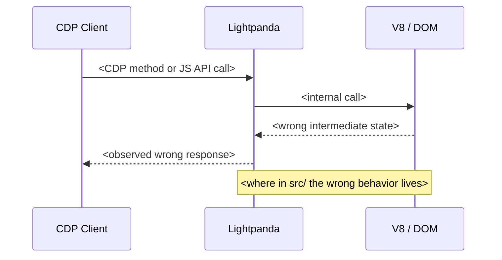
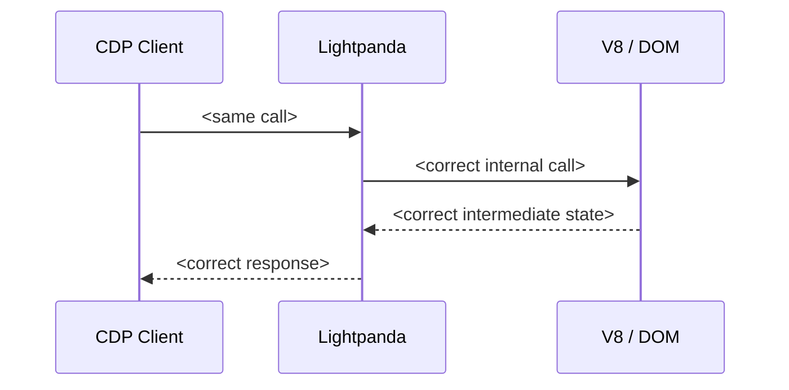

# Templates

Load this file when reaching Step 4 (implementation), Step 7 (issue), Step 8 (PR), or Step 9 (report). The fenced blocks below use ` ```` ` (four backticks) on the outside so the inner ` ``` ` mermaid/markdown fences survive copy-paste — strip the outer fence when pasting into GitHub.

---

## Implementation prompt (Step 4)

Use this as a self-contained brief. Two ways to apply it:

- **Inline** — work through the TDD steps yourself in the current conversation. Default if the change is small (single file, <100 LOC).
- **Subagent** — spawn a `general-purpose` agent with the prompt as `prompt:`. Better when the change spans multiple Zig files or you want to keep the main context lean.

Either way, fill in the `<...>` placeholders before applying — the prompt assumes a self-contained brief, no outside context.

````
**Context**: Working in `/Users/navid/code/browser`, the Lightpanda browser
(Zig 0.15.2 + V8). Branch `fix-<id>-<slug>`. Need to fix item `<ID>` from the
gem's upstream wishlist: `<one-line description>`.

**Today's behavior**: `<copy from wishlist>`

**Want**: `<copy from wishlist>`

**Where to look**:
- Primary: `<file from file-mapping.md>`
- Related: `<any test fixtures or sibling files>`

**TDD steps**:
1. Write a failing test in `<test file>` that exercises the bug. For CDP fixes
   use `test "cdp.<Domain> <method>"` blocks in the domain `.zig` file
   (pattern: see existing tests in `src/cdp/domains/network.zig`). For JS API
   fixes use HTML fixtures under `src/browser/tests/<area>/` (pattern: see
   `src/browser/tests/element/duplicate_ids.html` from PR #2244).
2. Mentally trace the failing test against current `main` and confirm it
   would fail. Do NOT run `zig build test` (or any `zig build` variant) —
   local Zig builds are forbidden (slow on the user's machine); upstream CI
   verifies on push.
3. Implement the fix in `<primary file>`. Keep the diff minimal — no
   surrounding cleanup, no formatting churn unrelated to the fix.
4. Mentally trace the test against the fixed code path and confirm it would
   now pass. Push the branch and let upstream CI run `zig build test` for
   the real verification — never run it locally.
5. Document any spec/CDP-protocol assumption in a code comment **only if** the
   assumption is non-obvious from the code itself.
````

---

## Issue body (Step 7)

````markdown
## Summary

<one paragraph describing the bug in CDP / browser-spec terms. No framework names. State the API surface (CDP method, JS API, DOM mutation pattern) and the observed wrong behavior.>

## Today's behavior

<two or three sentences: which CDP method or JS API, which event, which API surface. Include the exact wrong response/state.>



## Expected behavior

<spec citation: HTML Living Standard section URL, CDP protocol reference URL, or Chrome behavior reference. State exactly what should happen.>



## Reproducer

Self-contained: one HTML fixture + one shell script. Runs against a fresh `lightpanda serve` with no Ruby/Node ecosystem dependencies (or one `npm install --no-save chrome-remote-interface` if the CDP client is Node).

`repro.html`:
```html
<paste minimal HTML>
```

`repro.sh`:
```bash
<paste shell script>
```

(Optional) `repro.js`:
```js
<paste Node CDP driver if needed>
```

**Run**: `bash repro.sh`
- Today: prints `<exact observed output>` and exits 1.
- Expected: prints `<exact expected output>` and exits 0.

## Likely fix location

`src/<path>/<file>.zig` — `<function name>`. <one-line about what changes; no implementation specifics — that's the PR's job>.

## Environment

- Lightpanda: <commit sha or `main` HEAD>
- OS: <darwin/linux>
- CDP client: <curl / chrome-remote-interface vX.Y.Z>
````

### Filing it

```bash
gh issue create --repo lightpanda-io/browser \
  --title "<title — area: short description>" \
  --body "$(cat <<'EOF'
<paste full body>
EOF
)"
```

Capture the issue number from the response (e.g., `https://github.com/lightpanda-io/browser/issues/2400` → `2400`). The PR description and commit message both reference this number — wrong number means broken auto-close.

---

## Commit message (Step 8)

```
<area>: <one-line summary, imperative mood>

<2-4 sentence body explaining root cause and fix in CDP/browser-spec terms.
No framework jargon. No mention of capybara-lightpanda or any specific
downstream consumer.>

Closes #<issue-num>
```

Match the project's commit style — check `git log --oneline -20` for examples. Lightpanda uses lowercase area prefixes (`cdp:`, `dom:`, `forms:`, `page:`, `runtime:`, `network:`).

---

## PR description (Step 8)

````markdown
## What

<one-paragraph: the bug + the fix, in CDP/browser-spec terms>

Closes #<issue-num>.

## Root cause

<which Zig function, which control flow path, what was missing — three or four sentences max>


## Fix

<what changed in code — bullet list, two or three items>

- `src/<file>.zig` — `<function>`: <one-line>
- `src/<file>.zig` — `<function>`: <one-line>


## Test

- **Unit test**: `<file:test name>` — fails on `main`, passes with this commit.
- **Reproducer**: the `repro.sh` from #<issue-num> exits 1 on `main`, exits 0 with this commit. <one-sentence summary of what the script asserts>.

## Notes

<any caveats, deliberate scope limits, or follow-up issues to file>
````

Diagrams are not optional. They cut review time dramatically when the reviewer is doing surgery on engine code they didn't write.

Do **not** mention `capybara-lightpanda` or the wishlist by name. The fix should stand on its own merits — Lightpanda is a browser used by many clients, and naming one downstream consumer biases reviewers. Refer to "downstream CDP clients" generically if context demands.

---

## Final report to user (Step 9)

```
Item: <ID> — <title>
Branch: fix-<id>-<slug>
Issue: <URL>
PR:    <URL>

Diff: <files changed>, <lines>
Tests: <new Zig test names>
Reproducer: repro/<id>-<slug>/repro.sh — exits 1 on main, 0 with PR
Validation: <one-line — did the gem's workaround become deletable in principle? yes/no/partial>

Next:
- Wait for nightly to ship the fix.
- Follow-up gem PR: delete <workaround> in /Users/navid/code/capybara-lightpanda when nightly drops.
```

If you stopped before submitting (because the bug was already fixed, a duplicate exists, or the fix needed design discussion), the report explains why and what's needed to unblock — no issue/PR URL, but if you filed an issue without a PR, surface that URL.
