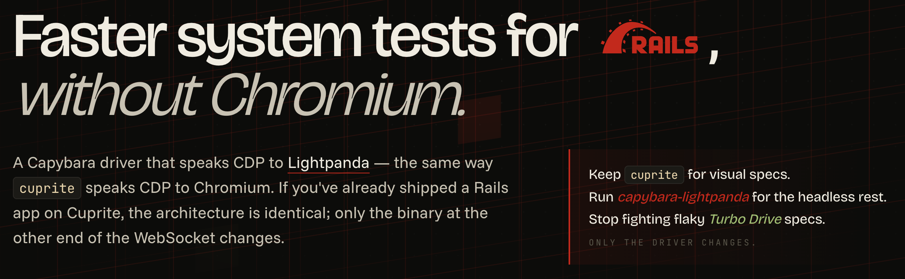

<div align="center">

# Capybara::Lightpanda

[](https://rubygems.org/gems/capybara-lightpanda)
[](https://rubygems.org/gems/capybara-lightpanda)
[](https://github.com/navidemad/capybara-lightpanda/actions/workflows/ci.yml)
[](https://rubyonrails.org/)
[](https://turbo.hotwired.dev/)

A [Capybara](https://github.com/teamcapybara/capybara) driver for [Lightpanda](https://lightpanda.io/), the fast headless browser built in Zig.<br>
Self-contained — built-in CDP client, no external browser-client gem required.

<strong>Capybara</strong>&nbsp;&nbsp;→&nbsp;&nbsp;<code>capybara-lightpanda</code>&nbsp;&nbsp;→&nbsp;&nbsp;<a href="https://lightpanda.io/"></a>&nbsp;<a href="https://github.com/lightpanda-io/browser/stargazers"></a>

[](https://navidemad.github.io/capybara-lightpanda/)
<sub><em>Configuration · dual-driver setups · Turbo Rails · capability matrix · beta-testing guide</em></sub>

[](https://navidemad.github.io/capybara-lightpanda/)

</div>

## Install

Add this to your `Gemfile` and run `bundle install`:

```ruby
group :test do
  gem "capybara-lightpanda"
end
```

In your test setup:

```ruby
require "capybara-lightpanda"
Capybara.javascript_driver = :lightpanda
```

> [!TIP]
> The Lightpanda binary is auto-downloaded on first use — no separate install step needed.

## Credits

- [Lightpanda](https://lightpanda.io/) — the headless browser
- [Capybara](https://github.com/teamcapybara/capybara) — the test framework
- Inspired by the [Cuprite](https://github.com/rubycdp/cuprite) / [Ferrum](https://github.com/rubycdp/ferrum) architecture and [`lightpanda-ruby`](https://github.com/marcoroth/lightpanda-ruby)

Patterns adapted from these MIT-licensed projects (cookies API, frame switching, node call/error conventions, retry/event utilities) are acknowledged with the original copyright notices in [NOTICE.md](NOTICE.md).

## Contributing

Bug reports and pull requests are welcome on [GitHub](https://github.com/navidemad/capybara-lightpanda).<br>
For beta-testing tips and how to file useful feedback, see [BETA_TESTING.md](BETA_TESTING.md).

## License

[MIT License](LICENSE.txt)
