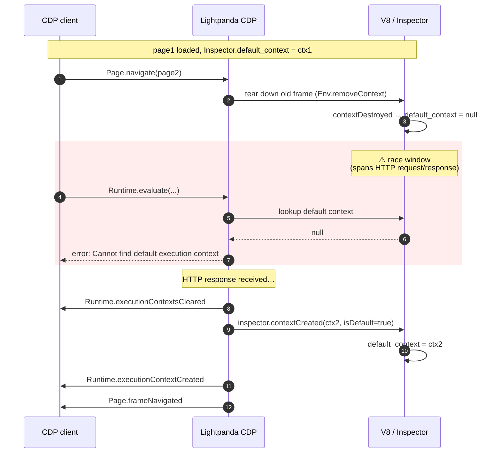

# Issue lightpanda-io/browser#2187 — draft reply

Draft reply addressing krichprollsch's two questions:

1. *"Don't we [emit `executionContextsCleared` / `executionContextCreated`]?"* — yes, you do; missed that on first read.
2. *"Do you reproduce [Chrome's behavior]?"* — yes, with one nuance: on Chrome the eval **doesn't fail** during nav (it's queued and resolved against whichever context is default once the runtime can service it; in our run that's the new page's).

Verified against:

- **Lightpanda nightly `2026.04.26.032819`** (`brew list --versions lightpanda`)
- **Headless Chrome `147.0.7727.103`**

3 consecutive runs of each (default + `--gate`) on each browser, all consistent — outputs below are verbatim.

---

## Reply

You're right — apologies, I missed that. `Runtime.executionContextsCleared` is emitted from [`src/cdp/domains/page.zig:518`](https://github.com/lightpanda-io/browser/blob/main/src/cdp/domains/page.zig#L518) and the matching `Runtime.executionContextCreated` follows from `inspector.contextCreated()` at [`:540`](https://github.com/lightpanda-io/browser/blob/main/src/cdp/domains/page.zig#L540). The premise of my previous comment was wrong.

On Chrome's behavior: yes, we reproduce it — `Runtime.evaluate` issued mid-navigation **doesn't fail** on Chrome. It gets held until a default context exists and resolves against the new page once it's up. That's the contract Capybara's polling pattern (and Puppeteer/Playwright auto-waits) leans on: `synchronize` retries `find`/`expect`; in-flight evals just resolve, the assertion either passes against the new page or times out. On Lightpanda the same call rejects with `Cannot find default execution context`.

So the race we hit isn't "no events" — it's the window where the old context is already gone but the new one isn't wired up yet:



The window opens and closes here:

- **Opens:** [`Inspector.contextDestroyed`](https://github.com/lightpanda-io/browser/blob/main/src/browser/js/Inspector.zig#L135) — called from [`Env.removeContext` (`Env.zig:355`)](https://github.com/lightpanda-io/browser/blob/main/src/browser/js/Env.zig#L355) — sets [`Inspector.default_context = null` (`Inspector.zig:140`)](https://github.com/lightpanda-io/browser/blob/main/src/browser/js/Inspector.zig#L140) at navigation start.
- **Closes:** the next [`inspector.contextCreated` at `frameNavigated` (`page.zig:540`)](https://github.com/lightpanda-io/browser/blob/main/src/cdp/domains/page.zig#L540) sets it again ([`Inspector.zig:127`](https://github.com/lightpanda-io/browser/blob/main/src/browser/js/Inspector.zig#L127)) — but only after the HTTP response comes back.
- **Width:** the full HTTP request/response wait, not just an inter-event gap.

Any client `Runtime.evaluate` landing in that window is rejected outright instead of being held until the new context is ready. **Notice in the failing trace below: `Cannot find default execution context` arrives _before_ any `Runtime.executionContextsCleared` for the page1→page2 nav** — the V8 context is already torn down at navigation start, while the cleared event isn't sent until `frameNavigated` fires later.

### Minimal repro

Node + `ws`, no other deps. Same script runs against both browsers (auto-detects the Chrome `webSocketDebuggerUrl` if present, falls back to `ws://host:port` for Lightpanda).

<details>
<summary><code>race-repro.js</code> — ~100 lines</summary>

```javascript
// race-repro.js — Runtime.evaluate races Runtime.executionContextCreated.
//
//   $ lightpanda serve --host 127.0.0.1 --port 9222 &
//   # or: chrome --headless=new --remote-debugging-port=9222 about:blank &
//   $ npm i ws
//   $ node race-repro.js          # FAIL on Lightpanda, OK on Chrome
//   $ node race-repro.js --gate   # OK on both (gate on executionContextCreated)

const http = require('http');
const WebSocket = require('ws');
const GATE = process.argv.includes('--gate');

let nextId = 1;
const pending = new Map();
const listeners = [];

function send(ws, sessionId, method, params = {}) {
  return new Promise((resolve, reject) => {
    const id = nextId++;
    pending.set(id, { resolve, reject });
    ws.send(JSON.stringify({ id, method, params, sessionId }));
  });
}
function once(method, predicate = () => true) {
  return new Promise((r) => listeners.push({ method, predicate, resolve: r }));
}

(async () => {
  // Origin server with a 50 ms delay so the race window stays open long
  // enough to reproduce reliably on a fast machine.
  const server = http.createServer((req, res) => {
    setTimeout(() => {
      res.writeHead(200, { 'Content-Type': 'text/html' });
      res.end(`<h1>${req.url.slice(1)}</h1>`);
    }, 50);
  });
  await new Promise((r) => server.listen(0, '127.0.0.1', r));
  const url = (p) => `http://127.0.0.1:${server.address().port}/${p}`;

  // Lightpanda accepts ws://host:port directly. Chrome only accepts the
  // per-instance webSocketDebuggerUrl from /json/version. Resolve once.
  const meta = await new Promise((resolve, reject) => {
    http.get('http://127.0.0.1:9222/json/version', (res) => {
      let body = '';
      res.on('data', (c) => (body += c));
      res.on('end', () => { try { resolve(JSON.parse(body)); } catch (e) { resolve({}); } });
    }).on('error', reject);
  });
  const wsUrl = meta.webSocketDebuggerUrl || 'ws://127.0.0.1:9222';
  const ws = new WebSocket(wsUrl);
  await new Promise((r) => ws.on('open', r));

  ws.on('message', (data) => {
    const msg = JSON.parse(data);
    if (msg.id) {
      const cb = pending.get(msg.id);
      if (cb) {
        pending.delete(msg.id);
        msg.error ? cb.reject(new Error(msg.error.message)) : cb.resolve(msg.result);
      }
    } else if (msg.method) {
      if (msg.method === 'Runtime.executionContextsCleared')
        console.error('  <- Runtime.executionContextsCleared');
      if (msg.method === 'Runtime.executionContextCreated')
        console.error('  <- Runtime.executionContextCreated id=' + msg.params.context.id);
      for (let i = listeners.length - 1; i >= 0; i--) {
        const l = listeners[i];
        if (l.method === msg.method && l.predicate(msg.params)) {
          listeners.splice(i, 1);
          l.resolve(msg);
        }
      }
    }
  });

  const { targetId } = await send(ws, undefined, 'Target.createTarget', { url: 'about:blank' });
  const { sessionId } = await send(ws, undefined, 'Target.attachToTarget', { targetId, flatten: true });

  await send(ws, sessionId, 'Page.enable');
  await send(ws, sessionId, 'Runtime.enable');

  await Promise.all([
    send(ws, sessionId, 'Page.navigate', { url: url('page1') }),
    once('Page.loadEventFired'),
  ]);
  const pre = await send(ws, sessionId, 'Runtime.evaluate', { expression: 'document.body.textContent' });
  console.error('initial:', JSON.stringify(pre.result.value));

  // Fire-and-forget. Do NOT await loadEventFired — that's the realistic
  // shape of the bug. Capybara/Puppeteer-style auto-retry clients issue
  // follow-up evals before the next load event.
  send(ws, sessionId, 'Page.navigate', { url: url('page2') }).catch(() => {});

  if (GATE) {
    await once('Runtime.executionContextCreated',
      (p) => p.context.auxData && p.context.auxData.isDefault);
    console.error('  gate: new default context up');
  }

  try {
    const post = await send(ws, sessionId, 'Runtime.evaluate',
      { expression: 'document.body.textContent' });
    console.log('OK:', JSON.stringify(post.result.value));
  } catch (e) {
    console.log('FAIL:', e.message);
  }

  ws.close();
  server.close();
  process.exit(0);
})();
```

</details>

### Verbatim output

**Lightpanda nightly `2026.04.26.032819`** — 3/3 runs each, identical:

```text
$ node race-repro.js
  <- Runtime.executionContextCreated id=1
  <- Runtime.executionContextsCleared
  <- Runtime.executionContextCreated id=2
initial: "page1"
FAIL: Cannot find default execution context
```

```text
$ node race-repro.js --gate
  <- Runtime.executionContextCreated id=1
  <- Runtime.executionContextsCleared
  <- Runtime.executionContextCreated id=2
initial: "page1"
  <- Runtime.executionContextsCleared
  <- Runtime.executionContextCreated id=3
  gate: new default context up
OK: "page2"
```

**Headless Chrome `147.0.7727.103`** — 3/3 runs each, identical:

```text
$ node race-repro.js
  <- Runtime.executionContextCreated id=1
  <- Runtime.executionContextsCleared
  <- Runtime.executionContextsCleared
  <- Runtime.executionContextCreated id=2
initial: "page1"
  <- Runtime.executionContextsCleared
  <- Runtime.executionContextsCleared
  <- Runtime.executionContextCreated id=3
OK: "page2"
```

`--gate` produces the same trace plus a `gate: new default context up` line and still ends in `OK: "page2"` — Chrome doesn't reject in either mode.

Summary:

| Run | Lightpanda nightly | Headless Chrome 147 |
| --- | --- | --- |
| `node race-repro.js` | **FAIL: Cannot find default execution context** | OK: `"page2"` |
| `node race-repro.js --gate` | OK: `"page2"` | OK: `"page2"` |

The failing Lightpanda run sees the eval rejection arrive **before** any `executionContextsCleared` for the page1→page2 nav — confirming the V8 default context is already null while the cleared event is still queued behind the HTTP wait. With `--gate` (wait for the new default context before issuing the eval), it passes. Chrome doesn't reject in either case.

### Two paths from here

Both fine for us:

1. **Client-side** — drop our blind retry, listen for `Runtime.executionContextCreated` and gate follow-up evals on its arrival. We'll do this on the gem side regardless.
2. **Upstream-side (matches Chrome)** — hold off on rejecting `Runtime.evaluate` while there is no default context. Either queue it until `inspector.contextCreated` runs for the new one, or keep the old V8 default context resolvable until the new one is ready, so destroy/create arrives as a tight pair around `frameNavigated`. Either way, clients issuing `evaluate` mid-nav stop seeing `Cannot find default execution context` and start matching the Chrome / Puppeteer / Playwright contract.
